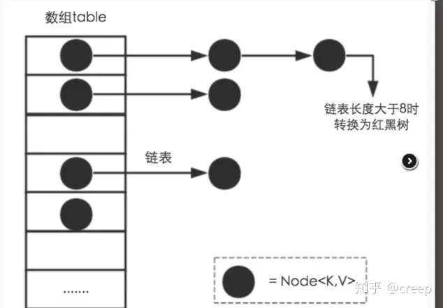

#### HashMap

#实现原理
数组 + 链表
JDB1.8之后 链表元素过多升级为红黑树

* DEFAULT_INITIAL_CAPACITY Table数组的初始化长度： 1 << 42^4=16（为什么要是 2的n次方？）
* MAXIMUM_CAPACITY Table数组的最大长度： 1<<302^30=1073741824
* DEFAULT_LOAD_FACTOR 负载因子：默认值为0.75。 当元素的总个数>当前数组的长度 * 负载因子。数组会进行扩容，扩容为原来的两倍（todo：为什么是两倍？）
* TREEIFY_THRESHOLD 链表树化阙值： 默认值为 8 。表示在一个node（Table）节点下的值的个数大于8时候，会将链表转换成为红黑树。
* UNTREEIFY_THRESHOLD 红黑树链化阙值： 默认值为 6 。 表示在进行扩容期间，单个Node节点下的红黑树节点的个数小于6时候，会将红黑树转化成为链表。
* MIN_TREEIFY_CAPACITY = 64 最小树化阈值，当Table所有元素超过改值，才会进行树化（为了防止前期阶段频繁扩容和树化过程冲突）

refs：
<https://zhuanlan.zhihu.com/p/127147909>